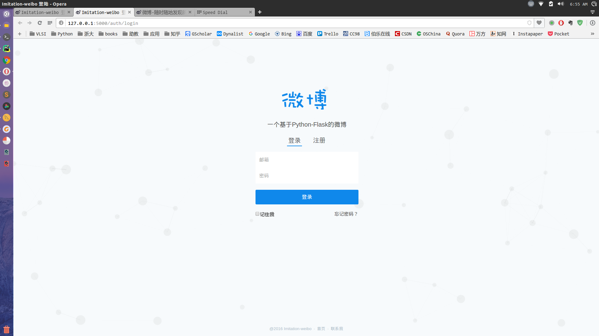
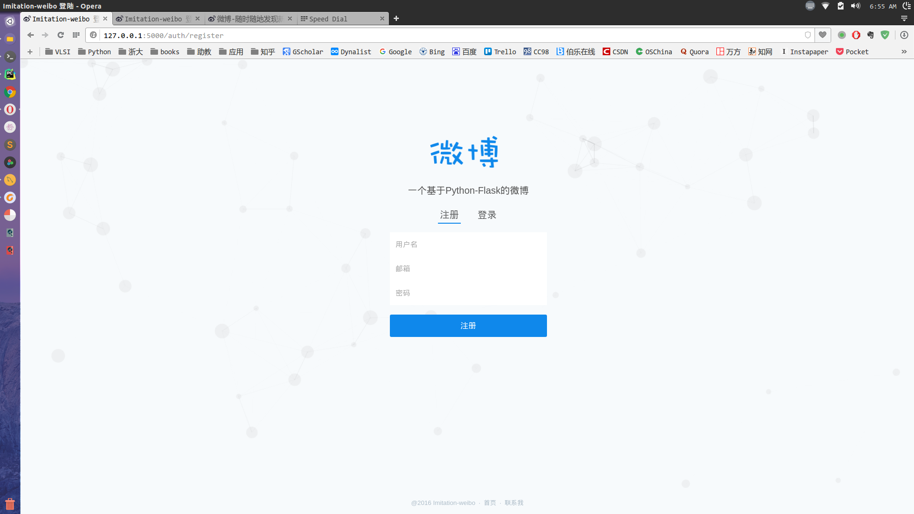
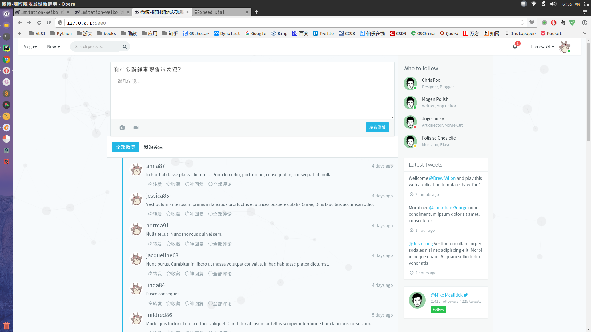
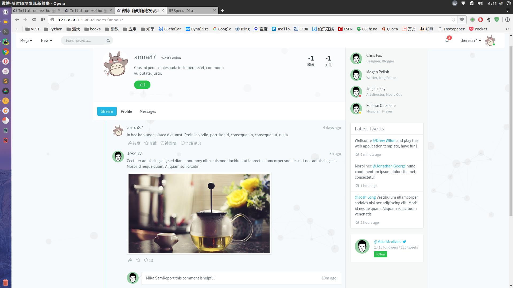
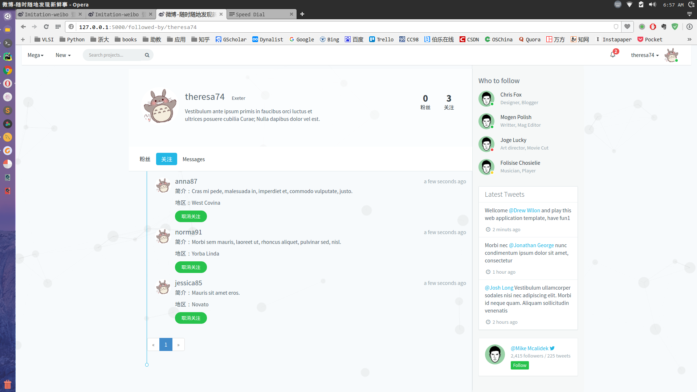
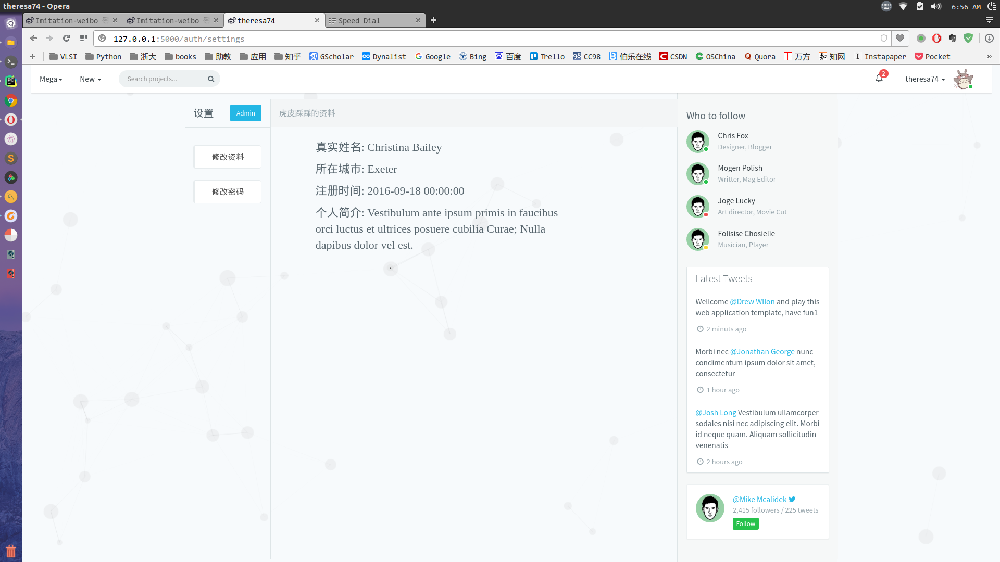

# Imatation-weibo

这是一个基于Python+Flask的，目前正在开发中的仿制的以及功能弱化版的微博。

- 数据库: MySQL, 使用SQLAlchemy操作
- 前端: 
    - Bootstrap,使用了Flask-bootstrap扩展
    - jQuery,实现ajax\页面效果等
    - 使用WTForms及其扩展Flask-WTF实现表单提交
- 登陆登出: Flask-Login
- API: 实现了RESTful风格的api架构

**注册和登陆页面:**
仿制了知乎的界面,使用了canvas画布,哈哈哈哈哈哈哈.

**首页**

**用户主页**

**用户关注列表页**

**设置页**

在我的博客，我记录了一步步开发这个项目的过程，欢迎访问<a href="http://amberno1111.github.io/">菜菜's' Blog</a>

**作者：琥珀菜菜**
